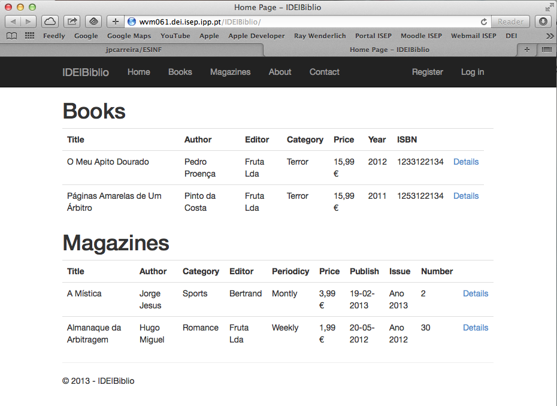
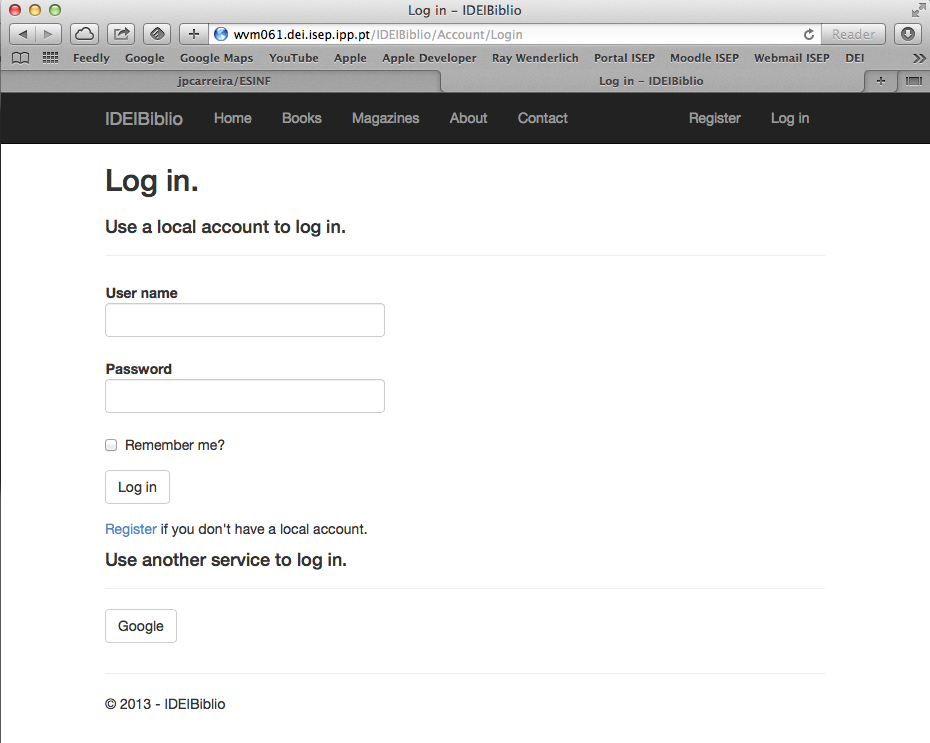
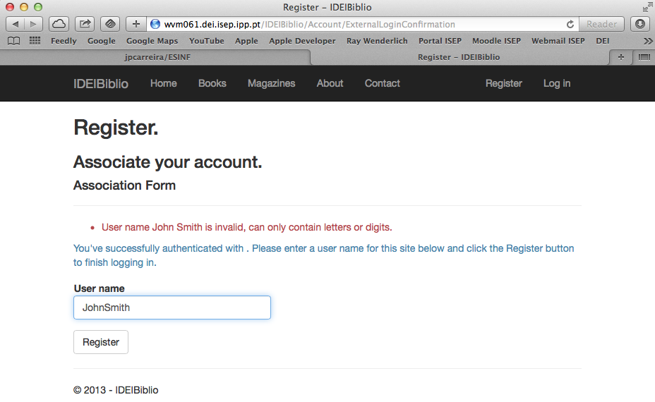
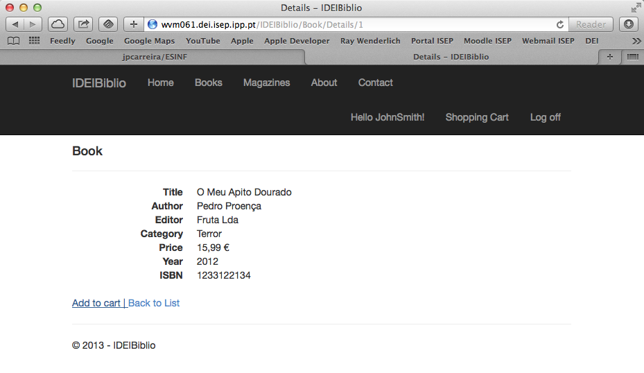
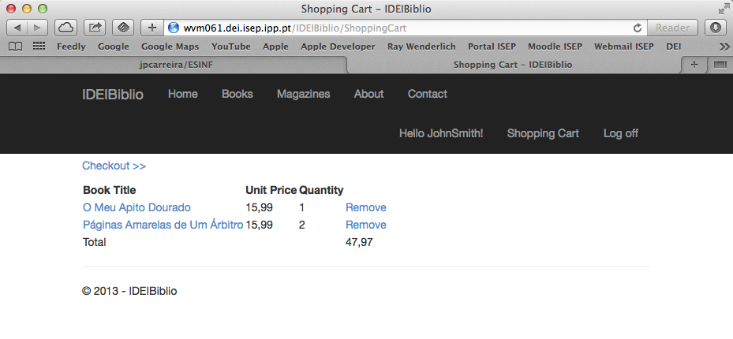
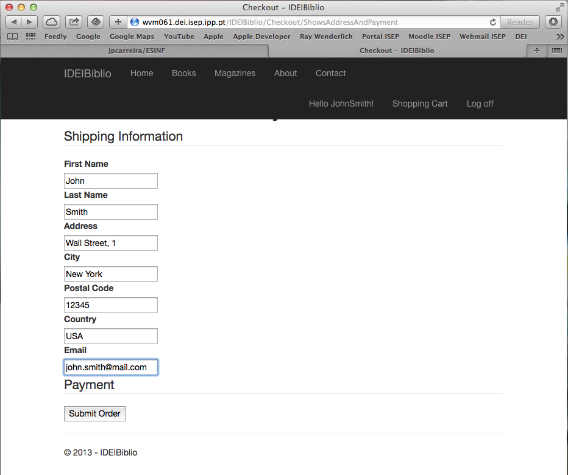
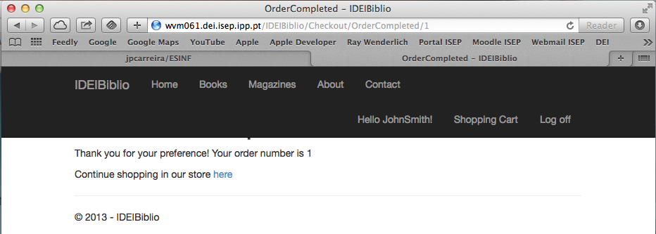
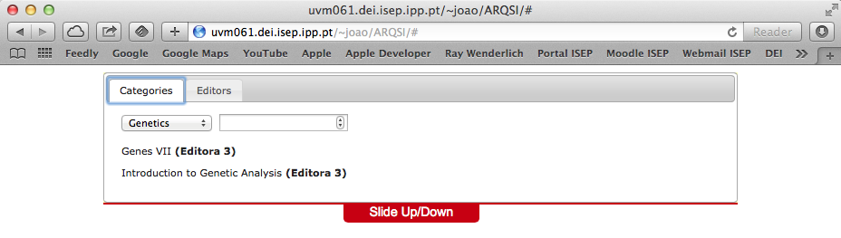
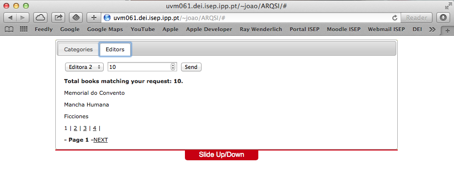
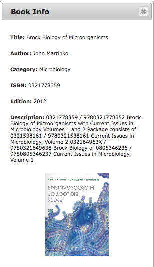

ARQSI
=====

Academic project in the scope of "Systems Architecture" (3rd year of Informatics Engineering). 
It consists in an online book store, where registered users can buy books and magazines.

Main features:
- the web application is mainly built in ASP.NET, using the MVC5 pattern
- an independent plugin, developed in PHP/JQUERY/AJAX, retrieves book information from webservices (including Google Reader)
- besides registered costumers, the application supports an Administrator and Product Manager login (the first with full access to
every area of the application, the later has a special area to manage books in stock)
- a costumer can login either by creating a new account or by using their native Google account
- email confirmation sent to costumer upon completion
- information regarding user accounts, books and orders are stored in a remote MS SQL Server database

Home Page

Login/Register account Page

Login using a Google account

Book details with the option to add to the shopping cart

The shopping cart

Entering details to finish order

Finished order (at this time the user receives a confirmation email)

Plugin showing available books, by category

Plugin showing available books, by editor

Plugin showing book details, provided by the Google Reader webservice

